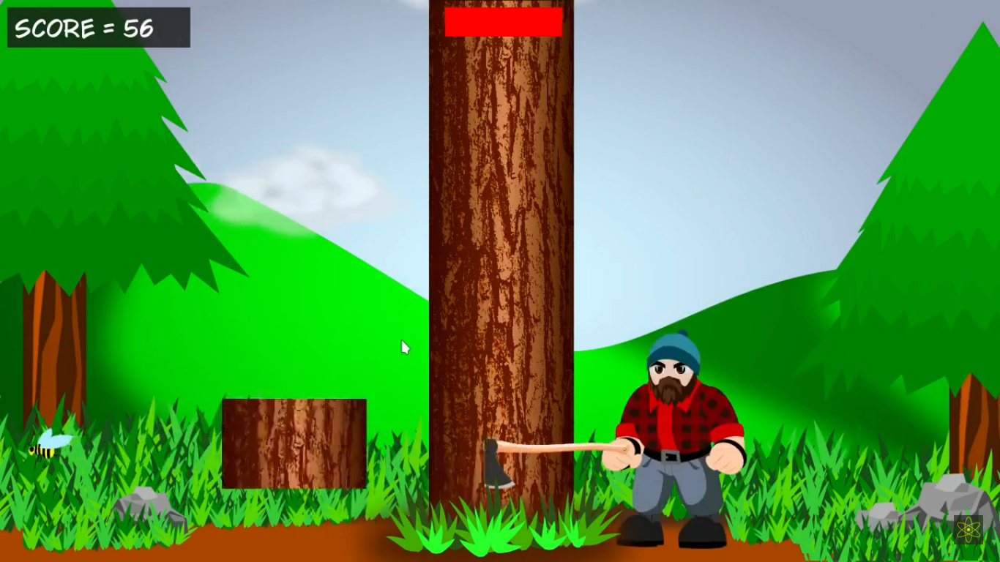

# A Timber Game 
I did this small project a while ago for the sole purpose of learning C++. That being said, there are lots of things that could be better implemented, and the code could also be cleaner, I just don't have the time to fix it now. It is playable though. I not only wrote the code, but also created the graphics and sound effects, which explains why everything looks and sounds so bad.  
  
### You can watch it at
[A Simple Linux Game with SFML and C++](https://www.youtube.com/watch?v=cUx-RM50Nyk)  

### How it looks
